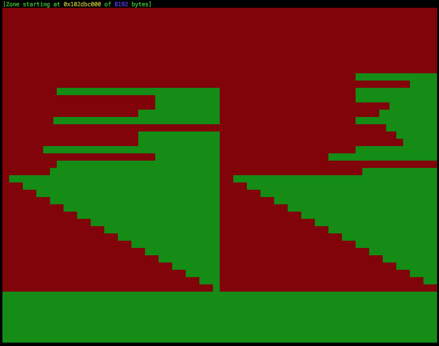

# Malloc

This project is about implementing a dynamic memory allocation mechanism.


Screenshot of the memory minimap feature.

# Usage

### Getting it

```bash
$> git clone https://github.com/grumbach/malloc && cd malloc && make
```

### Running programs using libft_malloc.so

```bash
$> ./run.sh ls #or any other program
```

### Using libft_malloc.so in lldb on macOS

```js
(lldb) env DYLD_LIBRARY_PATH=.
(lldb) env DYLD_INSERT_LIBRARIES="libft_malloc.so"
(lldb) env DYLD_FORCE_FLAT_NAMESPACE=1
```

# Features

```c
void	free(void *ptr);
void	*malloc(size_t size);
void	*calloc(size_t count, size_t size);
void	*realloc(void *ptr, size_t size);
void	*reallocf(void *ptr, size_t size);

void	show_alloc_mem();
void	show_alloc_mem_hex(void *ptr);
void	show_alloc_mem_minimap();
```
